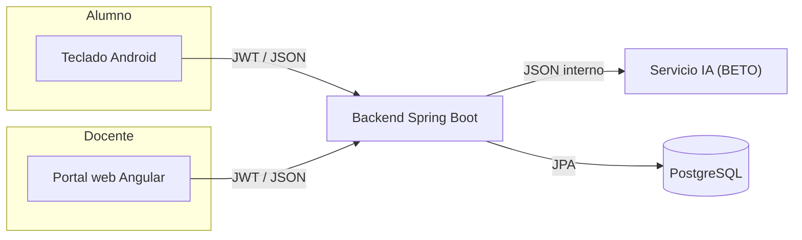

# Arquitectura e Integración del Sistema — Teclado Adaptativo

> Documento maestro que define cómo se integran las cuatro piezas del sistema:
> el **teclado Android**, el **backend** (Spring Boot), el **servicio de IA**
> (modelo BETO) y el **portal web del docente** (Angular).
>
> Este documento es la **fuente de verdad** de los contratos de integración.
> Si el código y este documento difieren, gana este documento y el código debe
> alinearse (ver la sección [12. Acciones pendientes](#12-acciones-pendientes)).
>
> Última actualización: 2026-06-06.

---

## 1. Visión general

Un teclado Android para estudiantes de primaria (6–12 años) con dislexia y
disgrafía. El alumno escribe normalmente y, **cuando lo decide**, pulsa un botón
para pedir una corrección contextual en español. El sistema le ofrece de 1 a 3
oraciones corregidas y el alumno acepta una o las ignora. Nada es automático.

El docente, desde un portal web, ve **métricas agregadas** del progreso de cada
alumno, sin acceder al contenido de los textos.

### 1.1. Componentes

| Componente | Tecnología | Responsabilidad |
| --- | --- | --- |
| **Teclado** | Android / FlorisBoard | UI del alumno, login, solicitud manual de corrección, aplicar/ignorar sugerencias. |
| **Backend** | Java 21 / Spring Boot 4 | Autenticación (JWT), cuentas pseudónimas, orquestación de correcciones, cálculo de KPIs, reportes, cifrado de datos personales. |
| **Servicio de IA** | Modelo BETO (BERT en español) | Recibe una oración y devuelve de 1 a 3 oraciones corregidas. Se afina por alumno. |
| **Portal web** | Angular | Dashboard del docente: alta de alumnos, KPIs y descarga de reportes. |

### 1.2. Diagrama de flujo principal



El flujo de una corrección:

1. El alumno escribe una oración y pulsa el botón IA.
2. El teclado envía la oración al **backend**.
3. El backend crea una sesión y llama al **servicio de IA** con la oración y el `studentId`.
4. La IA devuelve de 1 a 3 oraciones corregidas.
5. El backend guarda la sesión y responde al teclado con las sugerencias.
6. El alumno acepta una sugerencia o la ignora; el teclado lo registra como feedback.
7. Solo si el alumno **acepta**, el backend deriva las palabras corregidas (diff) para los KPIs.
8. El backend reenvía ese feedback a la IA (best-effort) para su entrenamiento por alumno.

---

## 2. Convenciones generales

- **Formato:** JSON en todas las comunicaciones.
- **Autenticación:** JWT Bearer (`Authorization: Bearer <token>`) en endpoints protegidos. Vence a las 5 horas por defecto.
- **Naming del contrato interno backend↔IA:** **inglés `camelCase`**.
- **Naming de la API pública (teclado y portal):** se mantiene en español `snake_case` donde ya existe (`texto_original`, `palabras_corregidas`, etc.), por compatibilidad con los clientes actuales.
- **Zonas horarias:** todas las marcas de tiempo en UTC (ISO-8601).
- **Identificadores:** UUID.

---

## 3. Roles y seguridad

- Dos roles en el JWT (claim `role`): `STUDENT` y `TEACHER`.
- La identidad **siempre** se toma del `subject` del JWT, nunca de parámetros del request. Un alumno solo puede operar sobre sus propios datos; un docente solo sobre los alumnos vinculados a él.
- Contraseñas con BCrypt. Nombres reales cifrados con AES-256-GCM (solo visibles para el docente).
- Endpoints públicos: `/api/v1/auth/**`, Swagger y `/actuator/health`. El resto exige autenticación.

---

## 4. Contrato Backend ↔ Servicio de IA

Endpoint interno (red privada, sin exposición pública):

```http
POST {AI_BASE_URL}/interno/corregir
Content-Type: application/json
```

### 4.1. Request (Backend → IA)

```json
{
  "originalText": "El nino iva a la escuela",
  "studentId": "7dc09a0f-66a6-40de-99c0-1511a12953a6"
}
```

| Campo | Tipo | Descripción |
| --- | --- | --- |
| `originalText` | string | **Una oración** escrita por el alumno. La unidad de corrección es la oración (no el texto completo). |
| `studentId` | UUID (string) | Alias pseudónimo del alumno. La IA lo usa para **afinar su respuesta por estudiante** (entrenamiento personalizado, alimentado por el feedback de 4.4). Es seudónimo: nunca contiene el nombre real, por lo que es seguro para privacidad. |

### 4.2. Response (IA → Backend)

```json
{
  "studentId": "7dc09a0f-66a6-40de-99c0-1511a12953a6",
  "correctedText": "El nino iba a la escuela",
  "processingTimeMs": 410,
  "suggestions": [
    "El nino iba a la escuela",
    "El nino iría a la escuela"
  ]
}
```

| Campo | Tipo | Descripción |
| --- | --- | --- |
| `studentId` | UUID (string) | Eco del alumno para trazabilidad. |
| `correctedText` | string | Oración corregida principal. Debe coincidir con `suggestions[0]`. |
| `processingTimeMs` | número (long) | Tiempo que tardó la IA en procesar. |
| `suggestions` | array de string | **De 1 a 3** oraciones completas corregidas, ordenadas de mejor a peor. La primera es la principal. |

### 4.3. Reglas del contrato

- `suggestions` tiene **entre 1 y 3** elementos. Si la IA no encuentra mejora, devuelve la oración original como única sugerencia (`correctedText` == `originalText`).
- La IA **no** clasifica el tipo de error ni devuelve detalle palabra por palabra. Esa simplicidad es intencional (ver decisión D2).
- La IA **no** devuelve confianza (`confidence`).
- Si la IA no responde o devuelve un cuerpo vacío, el backend responde `502 Bad Gateway` al cliente.

### 4.4. Feedback del alumno (Backend → IA)

Cuando el alumno acepta o rechaza una sugerencia, el backend —además de persistir
el feedback— lo **reenvía a la IA** para su entrenamiento por estudiante.

```http
POST {AI_BASE_URL}/interno/feedback
Content-Type: application/json
```

```json
{
  "studentId": "7dc09a0f-66a6-40de-99c0-1511a12953a6",
  "originalText": "El nino iva a la escuela",
  "selectedSuggestion": "El nino iba a la escuela",
  "accepted": true
}
```

| Campo | Tipo | Descripción |
| --- | --- | --- |
| `studentId` | UUID (string) | Alumno cuyo modelo se afina. |
| `originalText` | string | La oración que se había enviado a corregir. |
| `selectedSuggestion` | string \| null | Sugerencia que el alumno aceptó. `null` cuando rechaza. |
| `accepted` | boolean | `true` si aceptó una sugerencia, `false` si la ignoró. |

Reglas:

- Esta llamada es **best-effort**: si la IA no está disponible, el backend **igual guarda** el feedback del alumno y responde con normalidad. La indisponibilidad de la IA solo significa que esa señal de entrenamiento se pierde (queda registrada en el log).
- No espera cuerpo de respuesta relevante (basta `2xx`).

---

## 5. Contrato Backend ↔ Teclado (alumno)

URL base recomendada:

| Entorno | URL |
| --- | --- |
| Emulador Android → backend local | `http://10.0.2.2:8080` |
| Dispositivo físico → backend local | `http://<IP-LAN>:8080` |
| Producción | URL del despliegue en Google Cloud |

### 5.1. Login del alumno

```http
POST /api/v1/auth/students/login
```
El alumno usa un **alias amigable** (`palabra-NN`) y un **PIN de 4 dígitos**, ambos entregados por el profesor.
```json
{ "username": "tigre-07", "password": "4821" }
```
Respuesta `200`:
```json
{
  "userId": "7dc09a0f-...",
  "token": "<JWT>",
  "expiresAt": "2026-05-30T20:30:00Z",
  "role": "STUDENT"
}
```

### 5.2. Primer acceso y recuperación de PIN

- **No hay cambio de contraseña obligatorio.** Tras iniciar sesión, el alumno usa el teclado directamente (no existe pantalla de cambio ni bloqueo `403`).
- El PIN es permanente. Si el alumno lo olvida, **el profesor lo resetea** y obtiene un PIN nuevo (ver 6.3). El alumno no gestiona su propio PIN.

### 5.3. Perfil pseudónimo

```http
GET /api/v1/students/me
Authorization: Bearer <JWT>
```
```json
{
  "id": "7dc09a0f-...",
  "username": "tigre-07",
  "institution": "Colegio Ejemplo",
  "createdAt": "2026-05-30T15:00:00Z"
}
```

### 5.4. Solicitar corrección de una oración

```http
POST /api/v1/corrections/process
Authorization: Bearer <JWT>
```
```json
{ "texto_original": "El nino iva a la escuela" }
```
- `texto_original` es **una oración** (la unidad de corrección). Obligatorio, hasta 5000 caracteres.
- No se envía contexto adicional.

Respuesta `201`:
```json
{
  "id_sesion": "da89de19-...",
  "texto_original": "El nino iva a la escuela",
  "texto_corregido": "El nino iba a la escuela",
  "correcciones_realizadas": 1,
  "suggestions": [
    "El nino iba a la escuela",
    "El nino iría a la escuela"
  ],
  "suggestionOptions": [
    { "text": "El nino iba a la escuela", "recommended": true },
    { "text": "El nino iría a la escuela", "recommended": false }
  ],
  "sugerencia_elegida": null,
  "acepto_correccion": null,
  "tiempo_respuesta_ms": 410,
  "createdAt": "2026-05-30T15:25:00Z"
}
```

Notas importantes (cambios respecto a versiones anteriores):
- **Ya no** se devuelven `palabras_corregidas` en este punto: el detalle se calcula recién al aceptar (ver 5.5) y se consulta aparte (5.7).
- **Ya no** existe `confidence` ni `tipo_error` (la IA no los provee). `suggestionOptions` conserva solo `text` y `recommended`.
- `suggestions` trae de 1 a 3 oraciones. El teclado muestra cada una como **tarjeta/burbuja** cerca del teclado; la marcada como `recommended` es la principal. *(El diseño visual exacto está por definir.)*

### 5.5. Registrar feedback (aceptar / ignorar)

```http
PATCH /api/v1/corrections/sessions/{sessionId}/feedback
Authorization: Bearer <JWT>
```
Cuando **acepta**:
```json
{ "sugerencia_elegida": "El nino iba a la escuela", "acepto_correccion": true }
```
Cuando **ignora**:
```json
{ "sugerencia_elegida": null, "acepto_correccion": false }
```
- Si `acepto_correccion` es `true`, `sugerencia_elegida` es obligatoria y debe coincidir con una de las opciones ofrecidas (texto libre → `400`).
- **Solo al aceptar**, el backend calcula el *diff* entre `texto_original` y la **sugerencia elegida** y persiste las palabras corregidas, que alimentan el KPI de top de palabras.
- El backend **reenvía el feedback a la IA** (sección 4.4) para su entrenamiento por alumno. Es best-effort: si la IA falla, el feedback igual queda guardado.

> ¿Qué pasa con la sugerencia elegida? Tres destinos: (1) **el teclado** reemplaza el texto en la app destino (lado cliente, el backend no lo hace); (2) el backend la **persiste** en la sesión (`sugerencia_elegida` + `acepto_correccion`); (3) se usa para **KPIs** (diff → top palabras; flag → tasa de aceptación) y se **reenvía a la IA** para entrenamiento.

### 5.6. Historial de sesiones

```http
GET /api/v1/corrections/sessions?page=0&size=20
Authorization: Bearer <JWT>
```
Devuelve las sesiones del alumno, más recientes primero (`size` máx. 50). El historial no incluye el detalle de palabras.

### 5.7. Palabras corregidas de una sesión

```http
GET /api/v1/corrections/sessions/{sessionId}/words
Authorization: Bearer <JWT>
```
```json
[
  {
    "palabra_original": "iva",
    "palabra_corregida": "iba",
    "posicion_inicio": 8,
    "posicion_fin": 11
  }
]
```
- Solo devuelve datos si la sesión fue **aceptada** (antes de aceptar no hay palabras).
- Posiciones referidas a `texto_original`, **índice 0, fin exclusivo**.
- **Ya no** incluye `tipo_error` ni `confidence`.

### 5.8. Recomendaciones para el teclado

- Guardar el JWT en almacenamiento seguro del SO; nunca en texto plano.
- No registrar en logs JWT, contraseñas, alias ni textos.
- Enviar texto solo cuando el alumno lo pide expresamente.
- No reintentar automáticamente `POST /corrections/process` (cada llamada crea una sesión); ofrecer reintento manual ante `502`.

---

## 6. Contrato Backend ↔ Portal web (docente)

Todos los endpoints exigen un JWT con rol `TEACHER`.

### 6.1. Registro e inicio de sesión del docente

```http
POST /api/v1/auth/teachers/register
POST /api/v1/auth/teachers/login
```
`register` (`201`) y `login` (`200`) devuelven el mismo `AuthResponse` con `token`, `expiresAt` y `role: "TEACHER"`.

### 6.2. Crear cuenta de alumno

```http
POST /api/v1/teachers/students/accounts
Authorization: Bearer <JWT-DOCENTE>
```
```json
{ "studentRealName": "Nombre real del alumno", "notes": "Notas opcionales" }
```
El backend, en una sola transacción: genera el **alias amigable** (`palabra-NN`, p. ej. `tigre-07`), genera un **PIN de 4 dígitos**, hereda la institución del docente, **cifra** el nombre real y crea el vínculo docente-alumno.

Respuesta `201` (el `pin` se devuelve **una sola vez** para que el docente se lo entregue al alumno):
```json
{
  "linkId": "...",
  "studentId": "...",
  "username": "tigre-07",
  "pin": "4821",
  "studentRealName": "Nombre real del alumno",
  "institution": "Colegio Ejemplo",
  "notes": "Notas opcionales",
  "createdAt": "2026-05-30T15:00:00Z"
}
```

### 6.3. Resetear el PIN de un alumno

```http
POST /api/v1/teachers/students/{studentId}/reset-pin
Authorization: Bearer <JWT-DOCENTE>
```
Para cuando el alumno olvida su PIN. Solo funciona con alumnos vinculados al docente (`403` si no). Genera un PIN nuevo y lo devuelve **una sola vez**:
```json
{ "studentId": "...", "username": "tigre-07", "pin": "5390" }
```

### 6.4. Listar alumnos vinculados

```http
GET /api/v1/teachers/students
Authorization: Bearer <JWT-DOCENTE>
```
Devuelve los alumnos del docente con su nombre real **descifrado** (solo el docente lo ve).

### 6.5. KPIs por alumno

```http
GET /api/v1/kpis/students/{studentId}/acceptance-rate?month=2026-05
GET /api/v1/kpis/students/{studentId}/top-words?month=2026-05
GET /api/v1/kpis/students/{studentId}/summary?month=2026-05
```
- `month` en formato `YYYY-MM`.
- El docente solo puede consultar alumnos vinculados a él (`403` si no).
- **El endpoint `errors-by-type` queda eliminado** (ver decisión D3).
- `summary` combina la tasa de aceptación y el top de palabras del mes.

### 6.6. Reportes

```http
GET /api/v1/reports/students/{studentId}?month=2026-05        # disponibilidad
GET /api/v1/reports/students/{studentId}/pdf?month=2026-05    # descarga PDF
```
El reporte mensual en PDF incluye la tasa de aceptación y el top de palabras. **La sección de tipos de error se elimina.**

### 6.7. CORS

En producción, restringir los orígenes permitidos al dominio del portal Angular (hoy el backend permite `*`, aceptable solo en desarrollo).

---

## 7. Modelo de datos

Tablas principales (PostgreSQL, gestionadas por Flyway):

- **`student_users`** — cuentas pseudónimas (`username` tipo `palabra-NN`, p. ej. `tigre-07`), institución, hash del PIN. **Sin datos personales.**
- **`teacher_users`** — docentes (username, email, teléfono, institución, hash).
- **`teacher_student_links`** — vínculo docente↔alumno. Contiene `encrypted_student_real_name` (nombre real **cifrado**), notas, soft-delete (`deleted_at`), último acceso.
- **`correction_sessions`** — una por solicitud de corrección: `original_text`, `corrected_text`, sugerencias (JSON), `selected_suggestion`, `accepted_correction`, `response_time_ms`, fecha.
- **`word_corrections`** — palabras corregidas derivadas por el backend **al aceptar**: palabra original, palabra corregida, posiciones. *(Las columnas `error_type`/`confidence` quedan obsoletas — ver acciones pendientes.)*
- **`monthly_reports`** — snapshots históricos mensuales por alumno.

> Privacidad — nota honesta: el texto del alumno (`original_text`, `corrected_text`)
> se **almacena de forma persistente y en claro** para sostener el historial de
> sesiones. El docente **no** tiene endpoints para ver ese texto (solo métricas),
> pero el dato existe en la base. Ver sección [9. Privacidad](#9-privacidad).

---

## 8. KPIs y reportes

| KPI | Estado | Origen del dato |
| --- | --- | --- |
| **% de correcciones aceptadas** | ✅ Activo | Feedback del alumno (`accepted_correction` de las sesiones del mes). |
| **Top 10 palabras que más le cuestan** | ✅ Activo | *Diff* entre `texto_original` y la **sugerencia aceptada**, agregando frecuencia por palabra original. |
| **Distribución por tipo de error** | ❌ Eliminado | Requería que la IA clasificara el error; la IA ya no lo hace y el backend no puede inferirlo de forma fiable. |

Regla de conteo: una palabra cuenta como error/dificultad **solo cuando el alumno acepta** la corrección. Los errores que el alumno ignora no entran al top de palabras, pero sí se reflejan indirectamente en la **tasa de aceptación** (aceptar poco = ignorar ayuda).

---

## 9. Privacidad

- El **teclado nunca** conoce el nombre real del alumno: trabaja solo con el alias.
- El **nombre real** solo existe cifrado (AES-256-GCM) en `teacher_student_links` y solo el docente lo descifra.
- El **docente** ve únicamente métricas agregadas, no el contenido de los textos.
- Los **textos del alumno** sí se guardan de forma persistente (en claro) para el historial de sesiones del propio alumno. Esto debe quedar reflectado con honestidad en `contexto.md` (hoy afirma que no se guardan permanentemente).
- El **consentimiento** de privacidad se gestiona **fuera del sistema**, directamente con los padres de los alumnos. No forma parte del backend (ver acciones pendientes: eliminar módulo `consent`).

---

## 10. Despliegue (Google Cloud)

- Backend y servicio de IA desplegados en Google Cloud; el portal Angular como aplicación web.
- La comunicación backend↔IA (`/interno/corregir`) ocurre por **red privada**; el endpoint de la IA **no debe ser accesible públicamente**.
- Variables de entorno sensibles (`JWT_SECRET`, `PERSONAL_DATA_KEY_BASE64`, credenciales de BD, `AI_BASE_URL`) deben provenir del entorno/secret manager, nunca de los valores por defecto de `application.properties`.

---

## 11. Registro de decisiones

| ID | Decisión | Motivo |
| --- | --- | --- |
| D1 | Naming inglés `camelCase` en el contrato backend↔IA | Consistencia técnica; evita el mix español/inglés actual. |
| D2 | La IA devuelve solo `correctedText`, `processingTimeMs`, `studentId` y `suggestions` (1–3 oraciones) | El modelo es simple; no clasifica errores ni da confianza. |
| D3 | Se elimina el KPI y la sección de reporte de "tipo de error" | Sin clasificación de la IA no es computable de forma fiable. |
| D4 | Unidad de corrección = **una oración** | Más simple para niños de 6–12 años; encaja con sugerencias de oración completa. |
| D5 | El `studentId` se envía a la IA | La IA afina su respuesta por alumno (entrenamiento personalizado). |
| D6 | El *diff* de top-words se calcula contra la **sugerencia aceptada** | Refleja lo que el alumno realmente corrigió. |
| D7 | Una palabra cuenta como error **solo si se acepta** | Calidad del dato; evita falsos positivos de la IA. Coherente con D6. |
| D8 | El consentimiento sale del proyecto | Se gestiona con los padres fuera del sistema. |
| D9 | El texto del alumno se mantiene persistente y en claro | Soporta el historial de sesiones; se documenta con honestidad. |
| D10 | Modo offline fuera de alcance | Se aborda en una fase futura. |
| D11 | El feedback del alumno se reenvía a la IA (`POST /interno/feedback`), best-effort | Habilita el entrenamiento por alumno (D5); no debe romper el registro del feedback si la IA falla. |
| D12 | Acceso del alumno simplificado: alias `palabra-NN` + PIN de 4 dígitos, sin cambio de contraseña obligatorio; el profesor gestiona y resetea el PIN | Los alumnos (6–12) escriben sus credenciales en su propio celular; el flujo anterior (alias largo, contraseña de 12, cambio forzado) era demasiado complejo. Compromiso de seguridad consciente para cuentas pseudónimas de bajo valor. |

---

## 12. Acciones pendientes

Cambios de código necesarios para alinear el sistema con este documento:

### Backend ↔ IA — ✅ hecho
- [x] `AiCorrectionRequest`: reemplazar `texto_original`/`contexto_adicional` por `originalText` + `studentId`.
- [x] `AiCorrectionResponse`: dejar solo `studentId`, `correctedText`, `processingTimeMs`, `suggestions` (array de strings). Eliminar `correctionsCount`, `confidence`, `correctedWords` y sus DTOs (`AiWordCorrectionResponse`).
- [x] `HttpAiCorrectionClient`/`CorrectionService.process`: pasar el `studentId` a la IA.

### Lógica de corrección — ✅ hecho
- [x] Mover el cálculo de palabras corregidas desde `process` hacia `feedback`, calculándolo por *diff* entre `texto_original` y la sugerencia aceptada (`WordCorrectionDiff`).
- [x] Persistir `word_corrections` solo al aceptar.

### Feedback hacia la IA — ✅ hecho
- [x] `AiCorrectionClient.sendFeedback` + `AiFeedbackRequest`; `HttpAiCorrectionClient` hace `POST {AI_BASE_URL}/interno/feedback` (best-effort).
- [x] `CorrectionService.registerFeedback` reenvía el feedback a la IA tras persistirlo.
- [x] Propiedad `app.ai.feedback-path` (`AI_FEEDBACK_PATH`, default `/interno/feedback`).

### KPIs y reportes — ✅ hecho
- [x] Eliminar el endpoint `GET /kpis/students/{id}/errors-by-type` y su lógica.
- [x] Quitar la sección de tipos de error del reporte PDF y de `KpiSummaryResponse`.
- [x] Ajustar `monthly_reports` (campo `frequent_errors_json`) para reflejar top de palabras en vez de tipos de error (en el seeder de demo).

### Esquema de datos — ✅ hecho
- [x] Migración Flyway (`V3`): eliminar las columnas `error_type` y `confidence` de `word_corrections` y `confidence` de `correction_sessions`.

### Módulo consent — ✅ hecho
- [x] Eliminar el módulo `consent` (controller, service, DTOs, repositorio y modelo).
- [x] Migración Flyway (`V4`): eliminar la tabla `privacy_consents`.
- [x] Quitar la sección de consentimiento de la guía del teclado y del README.

### API pública del teclado — ✅ hecho (parcial)
- [x] Quitar `tipo_error` y `confidence` de `palabras_corregidas` y de `suggestionOptions`.
- [ ] Quitar la "explicación del error" del flujo del alumno (dependía del tipo de error) — pendiente en el cliente del teclado.

### Documentación — ✅ hecho
- [x] Corregir `contexto.md`: el texto del alumno **sí** se almacena y se retiró la mención al consentimiento dentro del sistema.
- [x] Quitar la referencia a los documentos inexistentes (`mobile-app-spec.md`, `Diseño_de_Datos_y_Comunicacion_v2.md`) y apuntar a este documento maestro.
- [x] Sincronizar `keyboard-app-integration-guide.md` con el contrato actual (sin `contexto_adicional`, sin `confidence`/`tipo_error`, `suggestionOptions` solo con `text`/`recommended`).

### Seguridad (producción) — ✅ hecho
- [x] CORS configurable por `app.security.allowed-origins` (`CORS_ALLOWED_ORIGINS`); en producción se restringe al dominio del portal.
- [x] Guard `SecurityPropertiesValidator`: con `app.security.allow-insecure-defaults=false` la app no arranca con los secretos por defecto.

### Pendiente en el cliente del teclado (fuera del backend)
- [ ] Quitar la "explicación del error" del flujo del alumno (dependía del tipo de error, que ya no existe).
```