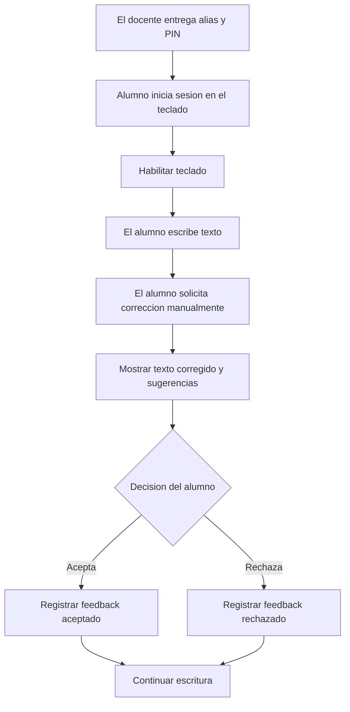

# Guia de integracion para la aplicacion de teclado

## 1. Objetivo

Este documento describe el contrato que debe utilizar la aplicacion de teclado para comunicarse con el backend. Esta guia esta enfocada en la experiencia del alumno dentro del teclado Android.

La aplicacion del teclado **no debe crear cuentas de alumnos ni manejar nombres reales**. La cuenta se crea previamente desde el portal del docente. El teclado recibe un alias amigable, por ejemplo `tigre-07`, y un PIN de 4 digitos.

## 2. Configuracion de conexion

La API utiliza JSON y JWT Bearer para los endpoints protegidos.

| Entorno | URL base recomendada |
| --- | --- |
| Backend local desde emulador Android | `http://10.0.2.2:8080` |
| Backend local desde dispositivo fisico | `http://<IP-LAN-DE-LA-PC>:8080` |
| Swagger desde la PC | `http://localhost:8080/swagger-ui.html` |

Para enviar JSON:

```http
Content-Type: application/json
```

Para consumir un endpoint protegido:

```http
Authorization: Bearer <JWT>
```

El JWT vence por defecto despues de 5 horas. El teclado debe almacenarlo en un mecanismo seguro del dispositivo y volver a mostrar el login si recibe `401 Unauthorized`.

## 3. Flujo principal del teclado



La correccion debe solicitarse mediante una accion explicita del alumno. El backend no recibe pulsaciones individuales ni realiza correcciones automaticas mientras el alumno escribe.

## 4. Endpoints utilizados por el teclado

### 4.1. Iniciar sesion como alumno

```http
POST /api/v1/auth/students/login
```

Endpoint publico. Autentica al alumno mediante su alias amigable y su PIN.

Request:

```json
{
  "username": "tigre-07",
  "password": "4821"
}
```

Response `200 OK`:

```json
{
  "userId": "7dc09a0f-66a6-40de-99c0-1511a12953a6",
  "token": "<JWT>",
  "expiresAt": "2026-05-30T20:30:00Z",
  "role": "STUDENT"
}
```

Comportamiento del cliente:

- Guardar `token`, `expiresAt` y `userId`.
- Verificar que `role` sea `STUDENT`.
- Tras iniciar sesion, el alumno puede usar el teclado directamente (no hay cambio de contrasena ni pantallas intermedias).
- Si las credenciales son incorrectas, el backend responde `401 Unauthorized`.

### 4.2. Primer acceso y PIN olvidado

- **No hay cambio de contrasena obligatorio.** El PIN que entrega el profesor es permanente; el alumno no lo cambia desde el teclado.
- Si el alumno **olvida el PIN**, debe pedirselo al profesor, que lo resetea desde el portal y le entrega uno nuevo. El teclado no necesita implementar nada para esto: basta con volver a iniciar sesion con el PIN nuevo.

### 4.3. Consultar el perfil pseudonimo

```http
GET /api/v1/students/me
Authorization: Bearer <JWT>
```

Response `200 OK`:

```json
{
  "id": "7dc09a0f-66a6-40de-99c0-1511a12953a6",
  "username": "tigre-07",
  "institution": "Colegio Ejemplo",
  "createdAt": "2026-05-30T15:00:00Z"
}
```

Este endpoint es util al iniciar la aplicacion para refrescar el estado real de la cuenta. El teclado no recibe el nombre real del alumno.

### 4.4. Solicitar una correccion

```http
POST /api/v1/corrections/process
Authorization: Bearer <JWT>
```

Procesa el texto cuando el alumno solicita ayuda. El backend crea una sesion, consulta el servicio de IA y almacena las correcciones detectadas.

Request:

```json
{
  "texto_original": "El nino iva a la escuela"
}
```

`texto_original` es obligatorio y admite hasta 5000 caracteres. Corresponde a **una sola oracion**: la unidad de correccion es la oracion, no el texto completo. No se envia contexto adicional.

Response `201 Created`:

```json
{
  "id_sesion": "da89de19-a580-4694-9ab7-f3373665bc04",
  "texto_original": "El nino iva a la escuela",
  "texto_corregido": "El nino iba a la escuela",
  "correcciones_realizadas": 0,
  "suggestions": [
    "El nino iba a la escuela",
    "El nino iria a la escuela"
  ],
  "suggestionOptions": [
    { "text": "El nino iba a la escuela", "recommended": true },
    { "text": "El nino iria a la escuela", "recommended": false }
  ],
  "sugerencia_elegida": null,
  "acepto_correccion": null,
  "tiempo_respuesta_ms": 410,
  "palabras_corregidas": [],
  "createdAt": "2026-05-30T15:25:00Z"
}
```

El teclado muestra `suggestions` (de 1 a 3 oraciones completas) como tarjetas o burbujas. `suggestionOptions` agrega el indicador `recommended` para resaltar la opcion principal, que coincide con `texto_corregido`. El servicio de IA no entrega un puntaje de confianza ni clasifica el tipo de error.

`correcciones_realizadas` llega en `0` y `palabras_corregidas` vacio en este punto: el detalle palabra por palabra se deriva cuando el alumno acepta una sugerencia (ver 4.5) y se consulta en 4.7.

### 4.5. Registrar si el alumno acepto o rechazo la sugerencia

```http
PATCH /api/v1/corrections/sessions/{sessionId}/feedback
Authorization: Bearer <JWT>
```

Debe enviarse despues de que el alumno elija que hacer con la sugerencia.

Request cuando acepta:

```json
{
  "sugerencia_elegida": "El nino iba a la escuela",
  "acepto_correccion": true
}
```

Request cuando rechaza:

```json
{
  "sugerencia_elegida": null,
  "acepto_correccion": false
}
```

Response `200 OK`: devuelve nuevamente la sesion completa con el feedback actualizado.

Cuando `acepto_correccion` es `true`, `sugerencia_elegida` es obligatoria y debe coincidir con una alternativa entregada previamente para esa sesion. El backend rechaza texto libre con `400 Bad Request`.

### 4.6. Consultar historial de sesiones

```http
GET /api/v1/corrections/sessions?page=0&size=20
Authorization: Bearer <JWT>
```

Devuelve las sesiones del alumno autenticado, ordenadas desde la mas reciente. El backend limita `size` a un maximo de 50.

Response `200 OK`:

```json
{
  "content": [
    {
      "id_sesion": "da89de19-a580-4694-9ab7-f3373665bc04",
      "texto_original": "El nino iva a la escuela",
      "texto_corregido": "El nino iba a la escuela",
      "correcciones_realizadas": 1,
      "suggestions": [
        "El nino iba a la escuela"
      ],
      "suggestionOptions": [
        { "text": "El nino iba a la escuela", "recommended": true }
      ],
      "sugerencia_elegida": "El nino iba a la escuela",
      "acepto_correccion": true,
      "tiempo_respuesta_ms": 410,
      "palabras_corregidas": [],
      "createdAt": "2026-05-30T15:25:00Z"
    }
  ],
  "page": 0,
  "size": 20,
  "totalElements": 1,
  "totalPages": 1
}
```

Para mantener liviano el historial, `palabras_corregidas` llega vacio en esta consulta. Si una vista necesita el detalle, debe utilizar el siguiente endpoint.

### 4.7. Consultar palabras corregidas de una sesion

```http
GET /api/v1/corrections/sessions/{sessionId}/words
Authorization: Bearer <JWT>
```

Devuelve las palabras corregidas de una sesion que pertenece al alumno autenticado.

Response `200 OK`:

```json
[
  {
    "id": "0fc368a8-60ed-4815-9608-ea4fcacde147",
    "palabra_original": "iva",
    "palabra_corregida": "iba",
    "posicion_inicio": 8,
    "posicion_fin": 11
  }
]
```

Las posiciones se refieren a `texto_original`, con indice 0 y fin exclusivo. Estas palabras solo existen cuando el alumno acepto una sugerencia.

## 5. Endpoint de contexto para el portal docente

Este endpoint **no debe implementarse dentro del teclado**. Se documenta para explicar de donde provienen las credenciales iniciales.

```http
POST /api/v1/teachers/students/accounts
Authorization: Bearer <JWT-DE-DOCENTE>
```

Request:

```json
{
  "studentRealName": "Nombre real del alumno",
  "notes": "Notas opcionales del docente"
}
```

El backend crea el alias amigable (`palabra-NN`), genera un PIN de 4 digitos, cifra el nombre real y vincula al alumno con el docente. El PIN se entrega una sola vez en la respuesta para que el docente pueda proporcionarselo al alumno.

## 6. Manejo de errores

Los errores controlados por la aplicacion utilizan esta estructura:

```json
{
  "timestamp": "2026-05-30T15:30:00Z",
  "status": 404,
  "error": "Not Found",
  "message": "Correction session not found",
  "path": "/api/v1/corrections/sessions/{id}/feedback",
  "validationErrors": {}
}
```

| Estado | Accion recomendada en el teclado |
| --- | --- |
| `400 Bad Request` | Mostrar validacion y no reintentar automaticamente. |
| `401 Unauthorized` | Limpiar sesion y solicitar login (credenciales incorrectas o sesion vencida). |
| `404 Not Found` | Informar que la sesion solicitada ya no esta disponible. |
| `502 Bad Gateway` | Informar que el servicio de correccion no esta disponible temporalmente y permitir reintentar manualmente. |

Los errores generados directamente por la capa de seguridad pueden responder `401` o `403` sin el mismo cuerpo JSON. El cliente debe tomar la decision principalmente a partir del codigo HTTP.

## 7. Estados recomendados en la aplicacion

| Estado local | Pantalla o comportamiento |
| --- | --- |
| `SIGNED_OUT` | Mostrar formulario de alias y PIN. |
| `READY` | Permitir escritura y solicitud manual de correccion. |
| `PROCESSING_CORRECTION` | Evitar solicitudes duplicadas y mostrar progreso. |
| `SHOWING_SUGGESTION` | Permitir aceptar o rechazar la sugerencia. |
| `SESSION_EXPIRED` | Limpiar JWT y volver al login. |

## 8. Recomendaciones de seguridad y privacidad

- Guardar el JWT mediante almacenamiento seguro del sistema operativo, no en texto plano.
- No registrar en logs JWT, contrasenas, nombres reales ni textos escritos por el alumno.
- No enviar texto al backend hasta que el alumno solicite expresamente la correccion.
- No intentar recuperar el nombre real del alumno: el teclado debe trabajar solo con el alias.
- Implementar timeout y reintento manual para `POST /api/v1/corrections/process`.
- Evitar reintentos automaticos del `POST /api/v1/corrections/process`, ya que cada solicitud crea una sesion.

## 9. Lista de implementacion para el equipo del teclado

- Configurar la URL base segun emulador, dispositivo fisico o ambiente desplegado.
- Implementar login de alumno (alias + PIN) y almacenamiento seguro del JWT.
- Consultar `GET /api/v1/students/me` al recuperar una sesion local.
- Incorporar la accion manual para solicitar correccion.
- Mostrar sugerencias y registrar siempre la decision de aceptar o rechazar.
- Manejar expiracion de sesion y caidas temporales del servicio de IA.
